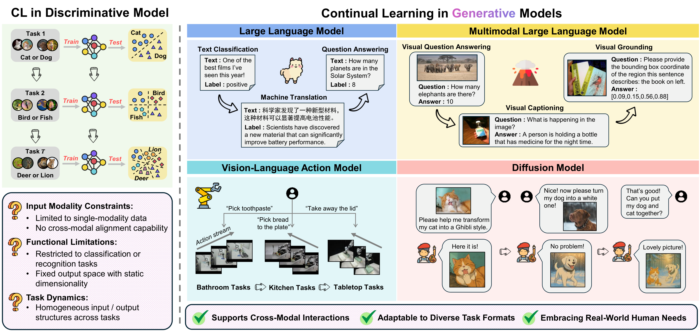

# Awesome-Continual-Learning-in-Generative-Models

## ✨ Motivation

The remarkable progress of generative models has equipped AI systems with human-level capabilities in content generation. Yet, their practical deployment is hindered by catastrophic forgetting—a fundamental issue where learning new tasks erases previously acquired knowledge. Despite growing interest, no comprehensive survey exists to systematically categorize and analyze continual learning methods for mainstream generative models (e.g., Large Language Models, Multimodal Large Language Models, Vision-Language Action Models and Diffusion Models). This work fills the gap by:

- **Classifying**​​ solutions into architecture-based, regularization-based, and replay-based paradigms, aligning with human-like memory mechanisms.
- **Analyzing**​​ task adaptations, benchmarks, and model backbones to reveal key insights.
- **Prospecting**​​ future directions for continual learning in generative models, paving the way for scalable and adaptable intelligence.



## 📰 News

- **2026.06**: 🔥🔥🔥 Community Highlight: Check out [MCITlib](https://arxiv.org/pdf/2508.07307), an open-source framework for Multimodal Continual Instruction Tuning. It provides out-of-the-box training and evaluation pipelines for 10+ methods across both image and video modalities, fully compatible with 4 diverse base models.
- **2026.01**: We have updated the repository to include relevant papers accepted to **ICLR 2026**. If you notice any omissions or have any questions, please feel free to open an issue!
- **2025.12**: We have released [MCITlib](https://arxiv.org/pdf/2508.07307), the first complete open-source codebase providing benchmarks and methods for Multimodal Continual Instruction Tuning. The code is open sourced [here](https://github.com/Ghy0501/MCITlib).
- **2025.07**: Check out our new work: "[Federated Continual Instruction Tuning](https://arxiv.org/pdf/2503.12897)" (ICCV 2025). The code is open sourced [here](https://github.com/Ghy0501/FCIT).
- **2025.07**: We have updated recent public work on continual learning in generative models. If you notice any omissions, please feel free to contact us!
- **2025.06**: We released our survey paper "[A Comprehensive Survey on Continual Learning in Generative Models](https://arxiv.org/pdf/2506.13045)". Feel free to cite or open pull requests!
- **2025.06**: We released a repository on continual learning in generative models, and a corresponding survey will be available soon.

## 📖 Framework

  * [Continual Learning in Large Language Model](#continual-learning-in-large-language-model)
  * [Continual Learning in Multimodal Large Language Model](#continual-learning-in-multimodal-large-language-model)
  * [Continual Learning in Vision-Language Action Model](#continual-learning-in-vision-language-action-model)
  * [Continual Learning in Diffusion Model](#continual-learning-in-diffusion-model)


## ⚖️ Benchmarks for Continual Learning in Generative Models

### Large Language Model
* SuperNI Benchmark [[Paper]](https://arxiv.org/pdf/2204.07705)
* Long Sequence Benchmark [[Paper]](https://arxiv.org/pdf/2301.12314)
* Standard CL Benchmark [[Paper]](https://proceedings.neurips.cc/paper/2015/file/250cf8b51c773f3f8dc8b4be867a9a02-Paper.pdf)

### Multimodal Large Language Model
* MCITlib Benchmark [[Paper]](https://arxiv.org/pdf/2508.07307)
* MLLM-CL Benchmark [[Paper]](https://arxiv.org/pdf/2506.05453)
* UCIT Benchmark [[Paper]](https://arxiv.org/pdf/2503.12941?)
* CoIN Benchmark [[Paper]](https://proceedings.neurips.cc/paper_files/paper/2024/file/6a45500d9eda640deed90d8a62742be5-Paper-Datasets_and_Benchmarks_Track.pdf)
* UCo-VQA Benchmark [[Paper]](https://openaccess.thecvf.com/content/CVPR2026/papers/Gao_Re-evaluating_Continual_VQA_Toward_Fair_and_Robust_Evaluation_for_Multimodal_CVPR_2026_paper.pdf) [[Code]](https://github.com/Zi-Jian-Gao/MaDQ)
* AndroidControl-CL / Android-CL Benchmark [[Paper]](https://openaccess.thecvf.com/content/CVPR2026/papers/Yao_CGL_Advancing_Continual_GUI_Learning_via_Reinforcement_Fine-Tuning_CVPR_2026_paper.pdf)

### Vision-Language Action Model
* LIBERO [[Paper]](https://proceedings.neurips.cc/paper_files/paper/2023/file/8c3c666820ea055a77726d66fc7d447f-Paper-Datasets_and_Benchmarks.pdf)

### Diffusion Model
* T2I-ConBench [[Paper]](https://arxiv.org/pdf/2505.16875)

## 🔖 Continual Learning in Large Language Model

### Architecture-based Approaches

| Paper | Venue | Code |
|---|---:|---|
| [SLIM: Let LLM Learn More and Forget Less with Soft LoRA and Identity Mixture](https://aclanthology.org/2025.naacl-long.246.pdf) | NAACL 2025 | - |
| [TreeLoRA: Efficient Continual Learning via Layer-Wise LoRAs Guided by a Hierarchical Gradient-Similarity Tree](https://arxiv.org/pdf/2506.10355?) | ICML 2025 | [Code](https://github.com/ZinYY/TreeLoRA) |
| [Spurious Forgetting in Continual Learning of Language Models](https://arxiv.org/pdf/2501.13453) | ICLR 2025 | [Code](https://github.com/zzz47zzz/spurious-forgetting) |
| [LOIRE: LifelOng learning on Incremental data via pre-trained language model gRowth Efficiently](https://openreview.net/pdf?id=F5PlYMC5ik#:~:text=To%20address%20the%20afore-%20mentioned%20issues%2C%20we%20introduce,to%20effectively%20grow%20their%20capacity%20using%20incremental%20data.) | ICLR 2025 | - |
| [SEE: Continual Fine-tuning with Sequential Ensemble of Experts](https://arxiv.org/pdf/2504.06664) | ACL findings 2025 | [Code](https://github.com/Linzwcs/SEE) |
| [Adaptive Prompting for Continual Relation Extraction: A Within-Task Variance Perspective](https://ojs.aaai.org/index.php/AAAI/article/view/34616) | AAAI 2025 | - |
| [Gradient Localization Improves Lifelong Pretraining of Language Models](https://arxiv.org/pdf/2411.04448) | arXiv 2024.11 | - |
| [MoRAL: MoE Augmented LoRA for LLMs' Lifelong Learning](https://arxiv.org/pdf/2402.11260) | arXiv 2024.02 | - |
| [Analyzing and Reducing Catastrophic Forgetting in Parameter Efficient Tuning](https://arxiv.org/pdf/2402.18865) | arXiv 2024.02 | [Code](https://github.com/which47/LLMCL) |
| [Q-Tuning: Queue-based Prompt Tuning for Lifelong Few-shot Language Learning](https://arxiv.org/pdf/2404.14607) | NAACL findings 2024 | - |
| [SAPT: AShared Attention Framework for Parameter-Efficient Continual Learning of Large Language Models](https://arxiv.org/pdf/2401.08295) | ACL 2024 | [Code](https://github.com/circle-hit/SAPT) |
| [Progressive Prompts: Continual Learning for Language Models](https://arxiv.org/pdf/2301.12314) | ICLR 2023 | [Code](https://github.com/arazd/ProgressivePrompts) |
| [Continual Learning in Task-Oriented Dialogue Systems](https://aclanthology.org/2021.emnlp-main.590.pdf) | EMNLP 2021 | [Code](https://github.com/andreamad8/ToDCL) |
| [Continual Learning for Task-oriented Dialogue System with Iterative Network Pruning, Expanding and Masking](https://arxiv.org/abs/2107.08173) | ACL 2021 | [Code](https://github.com/siat-nlp/TPEM) |

### Regularization-based Approaches

| Paper | Venue | Code |
|---|---:|---|
| [Sculpting Subspaces: Constrained Full Fine-Tuning in LLMs for Continual Learning](https://openreview.net/attachment?id=vQcyqsGJDw&name=pdf) | ICLR 2026 | - |
| [Meta-UCF: Unified Task-Conditioned LoRA Generation for Continual Learning in Large Language Models](https://openreview.net/attachment?id=iNg5KL7eTC&name=pdf) | ICLR 2026 | - |
| [Merge before Forget: A Single LoRA Continual Learning via Continual Merging](https://openreview.net/attachment?id=i1Rj7yU6eF&name=pdf) | ICLR 2026 | - |
| [Unlocking the Power of Function Vectors for Characterizing and Mitigating Catastrophic Forgetting in Continual Instruction Tuning](https://openreview.net/pdf?id=gc8QAQfXv6) | ICLR 2025 | [Code](https://github.com/GangweiJiang/FvForgetting) |
| [Velocitune: A Velocity-based Dynamic Domain Reweighting Method for Continual Pre-training](https://arxiv.org/pdf/2411.14318) | ACL 2025 | - |
| [Recurrent Knowledge Localization and Fusion for Language Model Continual Learning](https://arxiv.org/pdf/2502.17510) | ACL 2025 | [Code](https://github.com/WoodScene/Recurrent_KIF) |
| [SEEKR: Selective Attention-Guided Knowledge Retention for Continual Learning of Large Language Models](https://arxiv.org/pdf/2411.06171) | EMNLP 2024 | [Code](https://github.com/jinghan1he/SEEKR) |
| [TaSL: Continual Dialog State Tracking via Task Skill Localization and Consolidation](https://aclanthology.org/2024.acl-long.69.pdf) | ACL 2024 | [Code](https://github.com/WoodScene/TaSL) |
| [Enhancing Contrastive Learning with Noise-Guided Attack: Towards Continual Relation Extraction in the Wild](https://aclanthology.org/2024.acl-long.121.pdf) | ACL 2024 | [Code](https://github.com/CuteyThyme/Noisy-CRE) |
| [Continual Pre-Training of Language Models](https://arxiv.org/pdf/2302.03241) | ICLR 2023 | [Code](https://github.com/UIC-Liu-Lab/ContinualLM) |
| [Orthogonal Subspace Learning for Language Model Continual Learning](https://aclanthology.org/2023.findings-emnlp.715.pdf) | EMNLP findings 2023 | [Code](https://github.com/cmnfriend/O-LoRA) |
| [Large-scale Lifelong Learning of In-context Instructions and How to Tackle It](https://aclanthology.org/2023.acl-long.703.pdf) | ACL 2023 | - |
| [Continual Learning for Natural Language Generation in Task-oriented Dialog Systems](https://aclanthology.org/2020.findings-emnlp.310.pdf) | EMNLP findings 2020 | [Code](https://github.com/MiFei/Continual-Learning-for-NLG) |

### Replay-based Approaches

| Paper | Venue | Code |
|---|---:|---|
| [Mutual-pairing Data Augmentation for Fewshot Continual Relation Extraction](https://aclanthology.org/2025.naacl-long.205.pdf) | NAACL 2025 | - |
| [Empowering Math Problem Generation and Reasoning for Large Language Model via Synthetic Data based Continual Learning Framework](https://aclanthology.org/2025.emnlp-main.1223.pdf) | EMNLP 2025 | - |
| [Data-Efficient Selection via Grammatical Complexity in Continual Pre-training of Domain-Specific LLMs](https://aclanthology.org/2025.emnlp-main.1121.pdf) | EMNLP 2025 | [Code](https://github.com/PPMark0712/CDF-GC) |
| [Towards Effective and Efficient Continual Pre-training of Large Language Models](https://arxiv.org/pdf/2407.18743) | ACL 2025 | [Code](https://github.com/RUC-GSAI/Llama-3-SynE) |
| [Efficient Domain Continual pretraining by Mitigating the Stability Gap](https://arxiv.org/pdf/2406.14833) | ACL 2025 | - |
| [Don't Half-listen: Capturing Key-part Information in Continual Instruction Tuning](https://arxiv.org/pdf/2403.10056) | ACL 2025 | - |
| [Reviving Dormant Memories: Investigating Catastrophic Forgetting in Language Models through Rationale-Guidance Difficulty](https://arxiv.org/pdf/2411.11932) | arXiv 2024.11 | [Code](https://github.com/DIRECT-BIT/Reviving-Dormant-Memories) |
| [Towards Practical Tool Usage for Continually Learning LLMs](https://arxiv.org/pdf/2404.09339) | arXiv 2024.04 | - |
| [D-CPT Law: Domain-specific Continual Pre-Training Scaling Law for Large Language Models](https://proceedings.neurips.cc/paper_files/paper/2024/file/a4628e9fbd3002a554923642f74d5d6b-Paper-Conference.pdf) | NeurIPS 2024 | - |
| [InsCL: A Data-efficient Continual Learning Paradigm for Fine-tuning Large Language Models with Instructions](https://aclanthology.org/2024.naacl-long.37.pdf) | NAACL 2024 | [Code](https://github.com/OPPO-Mente-Lab/InsCL) |
| [Overcoming Catastrophic Forgetting by Exemplar Selection in Task-oriented Dialogue System](https://aclanthology.org/2024.findings-acl.5.pdf) | ACL findings 2024 | - |
| [Mitigating catastrophic forgetting in large language models with self-synthesized rehearsal](https://aclanthology.org/2024.acl-long.77.pdf) | ACL 2024 | [Code](https://github.com/DeepLearnXMU/SSR) |
| [Continual Learning with Dirichlet Generative-based Rehearsal](https://arxiv.org/pdf/2309.06917) | arXiv 2023.09 | - |
| [Generative Replay Inspired by Hippocampal Memory Indexing for Continual Language Learning](https://aclanthology.org/2023.eacl-main.65.pdf) | EACL 2023 | [Code](https://github.com/arumaekawa/GR-HMI) |
| [Prompt Conditioned VAE: Enhancing Generative Replay for Lifelong Learning in Task-Oriented Dialogue](https://aclanthology.org/2022.emnlp-main.766.pdf) | EMNLP 2022 | [Code](https://github.com/AlibabaResearch/DAMO-ConvAI/tree/main/pcll) |
| [Fine-tuned Language Models are Continual Learners](https://aclanthology.org/2022.emnlp-main.410.pdf) | EMNLP 2022 | [Code](https://github.com/ThomasScialom/T0_continual_learning) |
| [LAMOL: LAnguage MOdeling for Lifelong Language Learning](https://arxiv.org/pdf/1909.03329) | ICLR 2020 | [Code](https://github.com/chho33/LAMOL) |

### RL / RFT-based Approaches

| Paper | Venue | Code |
|---|---:|---|
| [Self-Distillation Enables Continual Learning](https://arxiv.org/abs/2601.19897) | ICML 2026 | [Code](http://idanshenfeld.com/SDFT) |

## 👓 Continual Learning in Multimodal Large Language Model

### Architecture-based Approaches

| Paper | Venue | Code |
|---|---:|---|
| [SAME: Stabilized Mixture-of-Experts for Multimodal Continual Instruction Tuning](https://coale.science/storage/pdfs/edca0013-77ab-4266-90e1-582c2d1f12cb.pdf) | ICML 2026 | - |
| [PCLR: Progressively Compressed LoRA for Multimodal Continual Instruction Tuning](https://openreview.net/attachment?id=WdP1NVSzsz&name=pdf) | ICLR 2026 | - |
| [On Token's Dilemma: Dynamic MoE with Drift-Aware Token Assignment for Continual Learning of Large Vision Language Models](https://arxiv.org/abs/2603.27481) | CVPR 2026 | - |
| [LoRA in LoRA: Towards Parameter-Efficient Architecture Expansionfor Continual Visual Instruction Tuning](https://arxiv.org/pdf/2508.06202) | AAAI 2026 | - |
| [MLLM-CL: Continual Learning for Multimodal Large Language Models](https://arxiv.org/pdf/2506.05453) | arXiv 2025.06 | [Code](https://github.com/bjzhb666/MLLM-CL) |
| [LLaVA-CMoE: Towards Continual Mixture of Experts for Large Vision-Language Models](https://arxiv.org/pdf/2503.21227) | arXiv 2025.03 | - |
| [Large Continual Instruction Assistant](https://arxiv.org/pdf/2410.10868) | ICML 2025 | [Code](https://github.com/JingyangQiao/CoIN) |
| [Dynamic Mixture of Curriculum LoRA Experts for Continual Multimodal Instruction Tuning](https://arxiv.org/pdf/2506.11672) | ICML 2025 | [Code](https://github.com/gcd19/D-MoLE) |
| [SMoLoRA: Exploring and Defying Dual Catastrophic Forgetting in Continual Visual Instruction Tuning](https://arxiv.org/pdf/2411.13949) | ICCV 2025 | [Code](https://github.com/Minato-Zackie/SMoLoRA) |
| [Federated Continual Instruction Tuning](https://arxiv.org/pdf/2503.12897) | ICCV 2025 | [Code](https://github.com/Ghy0501/FCIT) |
| [ModalPrompt: Dual-Modality Guided Prompt for Continual Learning of Large Multimodal Models](https://arxiv.org/pdf/2410.05849) | EMNLP 2025 | - |
| [CL-MoE: Enhancing Multimodal Large Language Model with Dual Momentum Mixture-of-Experts for Continual Visual Question Answering](https://arxiv.org/pdf/2503.00413?) | CVPR 2025 | [Code](https://github.com/ECNU-ICALK/CL-MoE) |
| [Progressive LoRA for Multimodal Continual Instruction Tuning](https://aclanthology.org/2025.findings-acl.143.pdf) | ACL findings 2025 | [Code](https://github.com/ku-nlp/ProgLoRA) |
| [HiDe-LLaVA: Hierarchical Decoupling for Continual Instruction Tuning of Multimodal Large Language Model](https://arxiv.org/pdf/2503.12941?) | ACL 2025 | [Code](https://github.com/Ghy0501/HiDe-LLaVA) |
| [Enhancing Multimodal Continual Instruction Tuning with BranchLoRA](https://arxiv.org/pdf/2506.02041) | ACL 2025 | [Code](https://github.com/BladeDancer957/BranchLoRA) |
| [Continual LLaVA: Continual Instruction Tuning in Large Vision-Language Models](https://arxiv.org/pdf/2411.02564) | arXiv 2024.11 | [Code](https://github.com/mengcaopku/Continual-LLaVA) |
| [Clumo: Cluster-based Modality Fusion Prompt for Continual Learning in Visual Question Answering](https://arxiv.org/pdf/2408.11742?) | arXiv 2024.08 | - |
| [Beyond Anti-Forgetting: Multimodal Continual Instruction Tuning with Positive Forward Transfer](https://arxiv.org/pdf/2401.09181) | arXiv 2024.01 | - |
| [CoIN: A Benchmark of Continual Instruction Tuning for Multimodal Large Language Models](https://proceedings.neurips.cc/paper_files/paper/2024/file/6a45500d9eda640deed90d8a62742be5-Paper-Datasets_and_Benchmarks_Track.pdf) | NeurIPS 2024 | [Code](https://github.com/zackschen/CoIN) |
| [Empowering Large Language Model for Continual Video Question Answering with Collaborative Prompting](https://aclanthology.org/2024.emnlp-main.227.pdf) | EMNLP 2024 | [Code](https://github.com/caicch/ColPro) |
| [Continual Instruction Tuning for Large Multimodal Models](https://arxiv.org/pdf/2311.16206) | arXiv 2023.11 | - |
| [Task-Attentive Transformer Architecture for Continual Learning of Vision-and-Language Tasks Using Knowledge Distillation](https://aclanthology.org/2023.findings-emnlp.466.pdf) | EMNLP findings 2023 | [Code](https://github.com/YuliangCai2022/TAMCL.git.) |
| [Decouple Before Interact: Multi-Modal Prompt Learning for Continual Visual Question Answering](https://openaccess.thecvf.com/content/ICCV2023/papers/Qian_Decouple_Before_Interact_Multi-Modal_Prompt_Learning_for_Continual_Visual_Question_ICCV_2023_paper.pdf) | CVPR 2023 | - |

### Regularization-based Approaches

| Paper | Venue | Code |
|---|---:|---|
| [Multimodal Continual Instruction Tuning with Dynamic Gradient Guidance](https://arxiv.org/abs/2511.15164) | ICML 2026 | [Code](https://github.com/lisongze/DGG) |
| [KeepLoRA: Continual Learning with Residual Gradient Adaptation](https://openreview.net/attachment?id=T3Vc5fkTzV&name=pdf) | ICLR 2026 | - |
| [Octopus: History-Free Gradient Orthogonalization for Continual Learning in Multimodal Large Language Models](https://openaccess.thecvf.com/content/CVPR2026/papers/Liu_Octopus_History-Free_Gradient_Orthogonalization_for_Continual_Learning_in_Multimodal_Large_CVPR_2026_paper.pdf) | CVPR 2026 | - |
| [LLaVA-c: Continual Improved Visual Instruction Tuning](https://arxiv.org/pdf/2506.08666) | arXiv 2025.06 | - |
| [Bisecle: Binding and Separation in Continual Learning for Video Language Understanding](https://arxiv.org/pdf/2507.00469) | NeruIPS 2025 | [Code](https://github.com/cruiseresearchgroup/Bisecle) |
| [SEFE: Superficial and Essential Forgetting Eliminator for Multimodal Continual Instruction Tuning](https://arxiv.org/pdf/2505.02486?) | ICML 2025 | [Code](https://github.com/jinpeng0528/SEFE/) |
| [Learn from Downstream and Be Yourself in Multimodal Large Language Model Fine-Tuning](https://arxiv.org/pdf/2411.10928) | ICML 2025 | - |
| [No Images, No Problem: Retaining Knowledge in Continual VQA with Questions-Only Memory](https://arxiv.org/pdf/2502.04469) | ICCV 2025 | [Code](https://github.com/IemProg/QUAD) |
| [LoRASculpt: Sculpting LoRA for Harmonizing General and Specialized Knowledge in Multimodal Large Language Models](https://arxiv.org/pdf/2503.16843) | CVPR 2025 | [Code](https://github.com/LiangJian24/LoRASculpt) |
| [Modality-Inconsistent Continual Learning of Multimodal Large Language Models](https://arxiv.org/pdf/2412.13050) | arXiv 2024.12 | - |
| [Enhancing Continual Learning in Visual Question Answering with Modality-Aware Feature Distillation](https://arxiv.org/pdf/2406.19297) | arXiv 2024.06 | - |
| [Continual Audio-Visual Sound Separation](https://proceedings.neurips.cc/paper_files/paper/2024/file/8af52d7acc4f0013661d4223d7e12b4c-Paper-Conference.pdf) | NeurIPS 2024 | [Code](https://github.com/weiguoPian/ContAV-Sep_NeurIPS2024) |
| [LLM-Assisted Multi-Teacher Continual Learning for Visual Question Answering in Robotic Surgery](https://arxiv.org/pdf/2402.16664) | ICRA 2024 | - |
| [Model Tailor: Mitigating Catastrophic Forgetting in Multi-modal Large Language Models](https://arxiv.org/pdf/2402.12048) | ICML 2024 | [Code](https://github.com/didizhu-zju/Model-Tailor) |
| [Revisiting Distillation for Continual Learning on Visual Question Localized-Answering in Robotic Surgery](https://arxiv.org/pdf/2307.12045) | MICCAI 2023 | [Code](https://github.com/longbai1006/CS-VQLA) |
| [Multi-Domain Lifelong Visual Question Answering via Self-Critical Distillation](https://dl.acm.org/doi/pdf/10.1145/3581783.3612121) | ACMMM 2023 | - |

### Replay-based Approaches

| Paper | Venue | Code |
|---|---:|---|
| [OASIS: Online Sample Selection for Continual Visual Instruction Tuning](https://arxiv.org/pdf/2506.02011?) | arXiv 2025.06 | - |
| [VLM-Assisted Continual learning for Visual Question Answering in Self-Driving](https://arxiv.org/pdf/2502.00843) | arXiv 2025.02 | - |
| [Adapt-∞: Scalable Continual Multimodal Instruction Tuning via Dynamic Data Selection](https://arxiv.org/pdf/2410.10636v1) | ICLR 2025 | [Code](https://github.com/adymaharana/adapt-inf) |
| [Multi-Prototype Grouping for Continual Learning in Visual Question Answering](https://ieeexplore.ieee.org/stamp/stamp.jsp?tp=&arnumber=10890400) | ICASSP 2025 | - |
| [VQACL: A Novel Visual Question Answering Continual Learning Setting](https://openaccess.thecvf.com/content/CVPR2023/papers/Zhang_VQACL_A_Novel_Visual_Question_Answering_Continual_Learning_Setting_CVPR_2023_paper.pdf) | CVPR 2023 | [Code](https://github.com/zhangxi1997/VQACL) |
| [Symbolic Replay: Scene Graph as Prompt for Continual Learning on VQA Task](https://ojs.aaai.org/index.php/AAAI/article/view/25208) | AAAI 2023 | [Code](https://github.com/showlab/CLVQA) |

### Preference-Optimization-based Approaches

| Paper | Venue | Code |
|---|---:|---|
| [phi-DPO: Fairness Direct Preference Optimization Approach to Continual Learning in Large Multimodal Models](https://arxiv.org/abs/2602.22601) | CVPR 2026 | [Code](https://github.com/uark-cviu/FaiDPO) |

### RL / RFT-based Approaches

| Paper | Venue | Code |
|---|---:|---|
| [Reinforcement Fine-Tuning Naturally Mitigates Forgetting in Continual Post-Training](https://arxiv.org/abs/2507.05386) | ICML 2026 | [Code](https://github.com/zhhvvv/rft_vs_sft) |
| [Continual GUI Agents](https://arxiv.org/abs/2601.20732) | ICML 2026 | [Code](https://github.com/Seconds123/GUI-AiF) |
| [CGL: Advancing Continual GUI Learning via Reinforcement Fine-Tuning](https://openaccess.thecvf.com/content/CVPR2026/papers/Yao_CGL_Advancing_Continual_GUI_Learning_via_Reinforcement_Fine-Tuning_CVPR_2026_paper.pdf) | CVPR 2026 | - |

### Evaluation / Benchmark

| Paper | Venue | Code |
|---|---:|---|
| [Re-evaluating Continual VQA: Toward Fair and Robust Evaluation for Multimodal Continual Learning](https://openaccess.thecvf.com/content/CVPR2026/papers/Gao_Re-evaluating_Continual_VQA_Toward_Fair_and_Robust_Evaluation_for_Multimodal_CVPR_2026_paper.pdf) | CVPR 2026 | [Code](https://github.com/Zi-Jian-Gao/MaDQ) |

### Knowledge / Safety Retention

| Paper | Venue | Code |
|---|---:|---|
| [KORE: Enhancing Knowledge Injection for Large Multimodal Models via Knowledge-Oriented Controls](https://arxiv.org/abs/2510.19316) | ICML 2026 | - |
| [Harmonious Parameter Adaptation in Continual Visual Instruction Tuning for Safety-Aligned MLLMs](https://arxiv.org/abs/2511.20158) | ICML 2026 | - |

### Video-Language Continual Learning

| Paper | Venue | Code |
|---|---:|---|
| [Affordance-First Decomposition for Continual Learning in Video-Language Understanding](https://arxiv.org/abs/2512.00694) | ICML 2026 | - |

## 🤖 Continual Learning in Vision-Language Action Model

### Architecture-based Approaches

| Paper | Venue | Code |
|---|---:|---|
| [CLARE: Continual Learning for Vision-Language-Action Models via Autonomous Adapter Routing and Expansion](https://arxiv.org/pdf/2601.09512) | arXiv 2026.01 | [Code](https://github.com/utiasDSL/clare) |
| [Lifelong Embodied Navigation Learning](https://openreview.net/attachment?id=PaYo96rjij&name=pdf) | ICLR 2026 | - |
| [$M^{3}E$: Continual Vision-and-Language Navigation via Mixture of Macro and Micro Experts](https://openreview.net/attachment?id=pFh5ygjN3V&name=pdf) | ICLR 2026 | - |
| [Preserving and Combining Knowledge in Robotic Lifelong Reinforcement Learning](https://www.nature.com/articles/s42256-025-00983-2.pdf) | Nature Machine Intelligence 2025 | - |
| [Hierarchical-Task-Aware Multi-modal Mixture of Incremental LoRA Experts for Embodied Continual Learning](https://arxiv.org/pdf/2506.04595) | ACL 2025 | - |
| [QueST: Self-Supervised Skill Abstractions for Learning Continuous Control](https://proceedings.neurips.cc/paper_files/paper/2024/file/076c3e48fa502c660902105965fdd9f6-Paper-Conference.pdf) | NeurIPS 2024 | [Code](https://quest-model.github.io/) |
| [LOTUS: Continual Imitation Learning for Robot Manipulation Through Unsupervised Skill Discovery](https://arxiv.org/pdf/2311.02058) | ICRA 2024 | [Code](https://ut-austin-rpl.github.io/Lotus/) |
| [LIBERO: Benchmarking Knowledge Transfer for Lifelong Robot Learning](https://proceedings.neurips.cc/paper_files/paper/2023/file/8c3c666820ea055a77726d66fc7d447f-Paper-Datasets_and_Benchmarks.pdf) | NeurIPS 2023 | [Code](https://libero-project.github.io/main.html) |

### Regularization-based Approaches

| Paper | Venue | Code |
|---|---:|---|
| [C-NAV: Towards Self-Evolving Continual Object Navigation in Open World](https://arxiv.org/pdf/2510.20685) | NeurIPS 2025 | [Code](https://github.com/BigTree765/C-Nav) |
| [M2Distill: Multi-Modal Distillation for Lifelong Imitation Learning](https://arxiv.org/pdf/2410.00064?) | arXiv 2024.10 | - |
| [Online Continual Learning for Interactive Instruction Following Agents](https://arxiv.org/pdf/2403.07548) | ICLR 2024 | [Code](https://github.com/snumprlab/cl-alfred) |

### Replay-based Approaches

| Paper | Venue | Code |
|---|---:|---|
| [Lifelong Imitation Learning with Multimodal Latent Replay and Incremental Adjustment](https://openaccess.thecvf.com/content/CVPR2026/papers/Yu_Lifelong_Imitation_Learning_with_Multimodal_Latent_Replay_and_Incremental_Adjustment_CVPR_2026_paper.pdf) | CVPR 2026 | [Code](https://github.com/yfqi/lifelong_mlr_ifa) |
| [iManip: Skill-Incremental Learning for Robotic Manipulation](https://arxiv.org/pdf/2503.07087) | arXiv 2025.03 | - |
| [Task-free Lifelong Robot Learning with Retrieval-based Weighted Local Adaptation](https://arxiv.org/pdf/2410.02995) | arXiv 2024.10 | - |

### Lifecycle / System Framework

| Paper | Venue | Code |
|---|---:|---|
| [Arcadia: Toward a Full-Lifecycle Framework for Embodied Lifelong Learning](https://arxiv.org/abs/2512.00076) | ICML 2026 | [Code](https://github.com/Embodied-Arcadia/EmbodiedKit/) |

## 🖌️ Continual Learning in Diffusion Model

### Architecture-based Approaches

| Paper | Venue | Code |
|---|---:|---|
| [Bring Your Dreams to Life: Continual Text-to-Video Customization](https://arxiv.org/pdf/2512.05802) | AAAI 2026 | [Code](https://github.com/JiahuaDong/CCVD) |
| [Continual Diffusion: Continual Customization of Text-to-Image Diffusion with C-LoRA](https://arxiv.org/pdf/2304.06027) | TMLR 2024 | - |

### Regularization-based Approaches

| Paper | Venue | Code |
|---|---:|---|
| [MuseumMaker: Continual Style Customization without Catastrophic Forgetting](https://arxiv.org/pdf/2404.16612) | TIP 2025 | - |
| [Mining Your Own Secrets: Diffusion Classifier Scores for Continual Personalization of Text-to-Image Diffusion Models](https://arxiv.org/pdf/2410.00700) | ICLR 2025 | - |
| [Continual Personalization for Diffusion Models](https://openaccess.thecvf.com/content/ICCV2025/papers/Liao_Continual_Personalization_for_Diffusion_Models_ICCV_2025_paper.pdf) | ICCV 2025 | - |
| [ConceptGuard: Continual Personalized Text-to-Image Generation with Forgetting and Confusion Mitigation](https://arxiv.org/pdf/2503.10358?) | CVPR 2025 | - |
| [Towards Lifelong Few-Shot Customization of Text-to-Image Diffusion](https://arxiv.org/pdf/2411.05544) | arXiv 2024.11 | - |
| [How to Continually Adapt Text-to-Image Diffusion Models for Flexible Customization?](https://proceedings.neurips.cc/paper_files/paper/2024/file/eadb6e5ed8a02ada4affb07dfd62ab5e-Paper-Conference.pdf) | NeurIPS 2024 | [Code](https://github.com/JiahuaDong/CIFC) |

### Replay-based Approaches

| Paper | Venue | Code |
|---|---:|---|
| [Create Your World: Lifelong Text-to-Image Diffusion](https://arxiv.org/pdf/2309.04430) | TPAMI 2024 | - |

## 🌞 Citation

```bibtex
@article{guo2025comprehensive,
  title={A Comprehensive Survey on Continual Learning in Generative Models},
  author={Guo, Haiyang and Zeng, Fanhu and Zhu, Fei and Wang, Jiayi and Wang, Xukai and Zhou, Jingang and Zhao, Hongbo and Liu, Wenzhuo and Ma, Shijie and Zhang, Xu-Yao and others},
  journal={arXiv preprint arXiv:2506.13045},
  year={2025}
}
```
