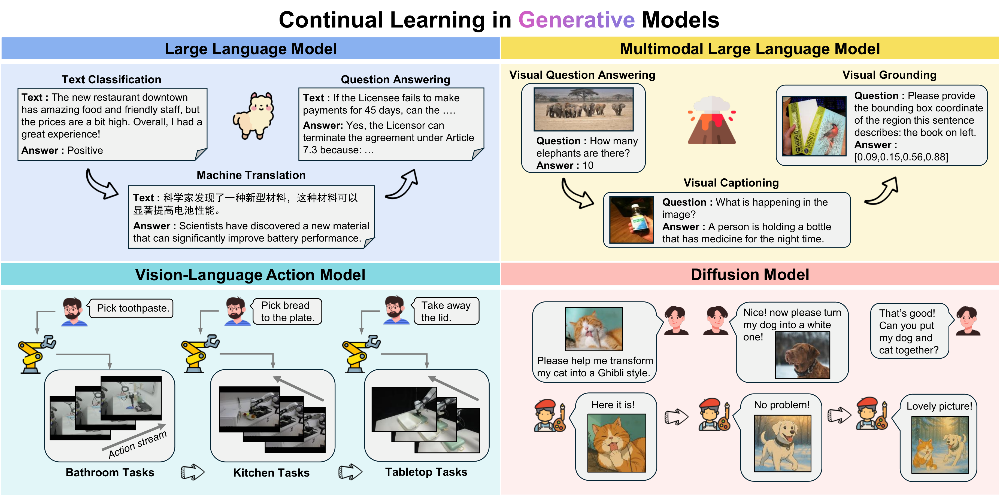

# Awesome-Continual-Learning-in-Generative-Models

## ✨ Motivation

The remarkable progress of generative models has equipped AI systems with human-level capabilities in content generation. Yet, their practical deployment is hindered by catastrophic forgetting—a fundamental issue where learning new tasks erases previously acquired knowledge. Despite growing interest, no comprehensive survey exists to systematically categorize and analyze continual learning methods for mainstream generative models (e.g., Large Language Models, Multimodal Large Language Models, Vision-Language Action Models and Diffusion Models). This work fills the gap by:

- **Classifying**​​ solutions into architecture-based, regularization-based, and replay-based paradigms, aligning with human-like memory mechanisms.
- **Analyzing**​​ task adaptations, benchmarks, and model backbones to reveal key insights.
- **Prospecting**​​ future directions for continual learning in generative models, paving the way for scalable and adaptable intelligence.



## 📰 News

- **2025.12**: We have released [MCITlib](https://arxiv.org/pdf/2508.07307), the first complete open-source codebase providing benchmarks and methods for Multimodal Continual Instruction Tuning. The code is open sourced [here](https://github.com/Ghy0501/MCITlib).
- **2025.07**: Check out our new work: "[Federated Continual Instruction Tuning](https://arxiv.org/pdf/2503.12897)" (ICCV 2025). The code is open sourced [here](https://github.com/Ghy0501/FCIT).
- **2025.07**: We have updated recent public work on continual learning in generative models. If you notice any omissions, please feel free to contact us!
- **2025.06**: We released our survey paper "[A Comprehensive Survey on Continual Learning in Generative Models](https://arxiv.org/pdf/2506.13045)". Feel free to cite or open pull requests!
- **2025.06**: We released a repository on continual learning in generative models, and a corresponding survey will be available soon.

## 📖 Framework

  * [Continual Learning in Large Language Model](#continual-learning-in-large-language-model)
  * [Continual Learning in Multimodal Large Language Model](#continual-learning-in-multimodal-large-language-model)
  * [Continual Learning in Vision-Language Action Model](#continual-learning-in-vision-language-action-model)
  * [Continual Learning in Diffusion Model](#continual-learning-in-diffusion-model)

## Continual Learning in Large Language Model

### Architecture-based Approaches
* Continual Learning for Task-oriented Dialogue System with Iterative Network Pruning, Expanding and Masking [[Paper]](https://arxiv.org/abs/2107.08173) [[Code]](https://github.com/siat-nlp/TPEM) 
* Spurious Forgetting in Continual Learning of Language Models [[Paper]](https://arxiv.org/pdf/2501.13453) [[Code]](https://github.com/zzz47zzz/spurious-forgetting) 
* Gradient Localization Improves Lifelong Pretraining of Language Models [[Paper]](https://arxiv.org/pdf/2411.04448) 
* LOIRE: LifelOng learning on Incremental data via pre-trained language model gRowth Efficiently [[Paper]](https://openreview.net/pdf?id=F5PlYMC5ik#:~:text=To%20address%20the%20afore-%20mentioned%20issues%2C%20we%20introduce,to%20effectively%20grow%20their%20capacity%20using%20incremental%20data.) 
* Continual Learning in Task-Oriented Dialogue Systems [[Paper]](https://aclanthology.org/2021.emnlp-main.590.pdf) [[Code]](https://github.com/andreamad8/ToDCL) 
* SAPT: AShared Attention Framework for Parameter-Efficient Continual Learning of Large Language Models [[Paper]](https://arxiv.org/pdf/2401.08295) [[Code]](https://github.com/circle-hit/SAPT) 
* MoRAL: MoE Augmented LoRA for LLMs' Lifelong Learning [[Paper]](https://arxiv.org/pdf/2402.11260) 
* Analyzing and Reducing Catastrophic Forgetting in Parameter Efficient Tuning [[Paper]](https://arxiv.org/pdf/2402.18865) [[Code]](https://github.com/which47/LLMCL) 
* SLIM: Let LLM Learn More and Forget Less with Soft LoRA and Identity Mixture [[Paper]](https://aclanthology.org/2025.naacl-long.246.pdf) 
* Progressive Prompts: Continual Learning for Language Models [[Paper]](https://arxiv.org/pdf/2301.12314) [[Code]](https://github.com/arazd/ProgressivePrompts) 
* Q-Tuning: Queue-based Prompt Tuning for Lifelong Few-shot Language Learning [[Paper]](https://arxiv.org/pdf/2404.14607) 
* Adaptive Prompting for Continual Relation Extraction: A Within-Task Variance Perspective [[Paper]](https://ojs.aaai.org/index.php/AAAI/article/view/34616) 
* SEE: Continual Fine-tuning with Sequential Ensemble of Experts [[Paper]](https://arxiv.org/pdf/2504.06664) [[Code]](https://github.com/Linzwcs/SEE) 
* TreeLoRA: Efficient Continual Learning via Layer-Wise LoRAs Guided by a Hierarchical Gradient-Similarity Tree [[Paper]](https://arxiv.org/pdf/2506.10355?) [[Code]](https://github.com/ZinYY/TreeLoRA) 

### Regularization-based Approaches
* Orthogonal Subspace Learning for Language Model Continual Learning [[Paper]](https://aclanthology.org/2023.findings-emnlp.715.pdf) [[Code]](https://github.com/cmnfriend/O-LoRA) 
* Continual Pre-Training of Language Models [[Paper]](https://arxiv.org/pdf/2302.03241) [[Code]](https://github.com/UIC-Liu-Lab/ContinualLM) 
* Continual Learning for Natural Language Generation in Task-oriented Dialog Systems [[Paper]](https://aclanthology.org/2020.findings-emnlp.310.pdf) [[Code]](https://github.com/MiFei/Continual-Learning-for-NLG) 
* SEEKR: Selective Attention-Guided Knowledge Retention for Continual Learning of Large Language Models [[Paper]](https://arxiv.org/pdf/2411.06171) [[Code]](https://github.com/jinghan1he/SEEKR) 
* TaSL: Continual Dialog State Tracking via Task Skill Localization and Consolidation [[Paper]](https://aclanthology.org/2024.acl-long.69.pdf) [[Code]](https://github.com/WoodScene/TaSL) 
* Large-scale Lifelong Learning of In-context Instructions and How to Tackle It [[Paper]](https://aclanthology.org/2023.acl-long.703.pdf) 
* Enhancing Contrastive Learning with Noise-Guided Attack: Towards Continual Relation Extraction in the Wild [[Paper]](https://aclanthology.org/2024.acl-long.121.pdf) [[Code]](https://github.com/CuteyThyme/Noisy-CRE) 
* Unlocking the Power of Function Vectors for Characterizing and Mitigating Catastrophic Forgetting in Continual Instruction Tuning [[Paper]](https://openreview.net/pdf?id=gc8QAQfXv6) [[Code]](https://github.com/GangweiJiang/FvForgetting) 
* Velocitune: A Velocity-based Dynamic Domain Reweighting Method for Continual Pre-training [[Paper]](https://arxiv.org/pdf/2411.14318) 
* Recurrent Knowledge Localization and Fusion for Language Model Continual Learning [[Paper]](https://arxiv.org/pdf/2502.17510) [[Code]](https://github.com/WoodScene/Recurrent_KIF) 

### Replay-based Approaches
* Fine-tuned Language Models are Continual Learners [[Paper]](https://aclanthology.org/2022.emnlp-main.410.pdf) [[Code]](https://github.com/ThomasScialom/T0_continual_learning) 
* Towards Practical Tool Usage for Continually Learning LLMs [[Paper]](https://arxiv.org/pdf/2404.09339) 
* Mutual-pairing Data Augmentation for Fewshot Continual Relation Extraction [[Paper]](https://aclanthology.org/2025.naacl-long.205.pdf) 
* InsCL: A Data-efficient Continual Learning Paradigm for Fine-tuning Large Language Models with Instructions [[Paper]](https://aclanthology.org/2024.naacl-long.37.pdf) [[Code]](https://github.com/OPPO-Mente-Lab/InsCL) 
* Overcoming Catastrophic Forgetting by Exemplar Selection in Task-oriented Dialogue System [[Paper]](https://aclanthology.org/2024.findings-acl.5.pdf) 
* Reviving Dormant Memories: Investigating Catastrophic Forgetting in Language Models through Rationale-Guidance Difficulty [[Paper]](https://arxiv.org/pdf/2411.11932) [[Code]](https://github.com/DIRECT-BIT/Reviving-Dormant-Memories) 
* D-CPT Law: Domain-specific Continual Pre-Training Scaling Law for Large Language Models [[Paper]](https://proceedings.neurips.cc/paper_files/paper/2024/file/a4628e9fbd3002a554923642f74d5d6b-Paper-Conference.pdf) 
* LAMOL: LAnguage MOdeling for Lifelong Language Learning [[Paper]](https://arxiv.org/pdf/1909.03329) [[Code]](https://github.com/chho33/LAMOL) 
* Generative Replay Inspired by Hippocampal Memory Indexing for Continual Language Learning [[Paper]](https://aclanthology.org/2023.eacl-main.65.pdf) [[Code]](https://github.com/arumaekawa/GR-HMI) 
* Prompt Conditioned VAE: Enhancing Generative Replay for Lifelong Learning in Task-Oriented Dialogue [[Paper]](https://aclanthology.org/2022.emnlp-main.766.pdf) [[Code]](https://github.com/AlibabaResearch/DAMO-ConvAI/tree/main/pcll) 
* Continual Learning with Dirichlet Generative-based Rehearsal [[Paper]](https://arxiv.org/pdf/2309.06917) 
* Mitigating catastrophic forgetting in large language models with self-synthesized rehearsal [[Paper]](https://aclanthology.org/2024.acl-long.77.pdf) [[Code]](https://github.com/DeepLearnXMU/SSR) 
* Towards Effective and Efficient Continual Pre-training of Large Language Models [[Paper]](https://arxiv.org/pdf/2407.18743) [[Code]](https://github.com/RUC-GSAI/Llama-3-SynE) 
* Don't Half-listen: Capturing Key-part Information in Continual Instruction Tuning [[Paper]](https://arxiv.org/pdf/2403.10056) 
* Efficient Domain Continual pretraining by Mitigating the Stability Gap [[Paper]](https://arxiv.org/pdf/2406.14833) 
* Data-Efficient Selection via Grammatical Complexity in Continual Pre-training of Domain-Specific LLMs [[Paper]](https://aclanthology.org/2025.emnlp-main.1121.pdf) [[Code]](https://github.com/PPMark0712/CDF-GC) 
* Empowering Math Problem Generation and Reasoning for Large Language Model via Synthetic Data based Continual Learning Framework [[Paper]](https://aclanthology.org/2025.emnlp-main.1223.pdf) 


## Continual Learning in Multimodal Large Language Model

### Architecture-based Approaches
* Continual Instruction Tuning for Large Multimodal Models [[Paper]](https://arxiv.org/pdf/2311.16206) 
* Task-Attentive Transformer Architecture for Continual Learning of Vision-and-Language Tasks Using Knowledge Distillation [[Paper]](https://aclanthology.org/2023.findings-emnlp.466.pdf) [[Code]](https://github.com/YuliangCai2022/TAMCL.git.) 
* CoIN: A Benchmark of Continual Instruction Tuning for Multimodal Large Language Models [[Paper]](https://proceedings.neurips.cc/paper_files/paper/2024/file/6a45500d9eda640deed90d8a62742be5-Paper-Datasets_and_Benchmarks_Track.pdf) [[Code]](https://github.com/zackschen/CoIN) 
* Continual LLaVA: Continual Instruction Tuning in Large Vision-Language Models [[Paper]](https://arxiv.org/pdf/2411.02564) [[Code]](https://github.com/mengcaopku/Continual-LLaVA) 
* HiDe-LLaVA: Hierarchical Decoupling for Continual Instruction Tuning of Multimodal Large Language Model [[Paper]](https://arxiv.org/pdf/2503.12941?) [[Code]](https://github.com/Ghy0501/HiDe-LLaVA) 
* Large Continual Instruction Assistant [[Paper]](https://arxiv.org/pdf/2410.10868) [[Code]](https://github.com/JingyangQiao/CoIN) 
* SMoLoRA: Exploring and Defying Dual Catastrophic Forgetting in Continual Visual Instruction Tuning [[Paper]](https://arxiv.org/pdf/2411.13949) [[Code]](https://github.com/Minato-Zackie/SMoLoRA) 
* CL-MoE: Enhancing Multimodal Large Language Model with Dual Momentum Mixture-of-Experts for Continual Visual Question Answering [[Paper]](https://arxiv.org/pdf/2503.00413?) [[Code]](https://github.com/ECNU-ICALK/CL-MoE) 
* LLaVA-CMoE: Towards Continual Mixture of Experts for Large Vision-Language Models [[Paper]](https://arxiv.org/pdf/2503.21227) 
* Federated Continual Instruction Tuning [[Paper]](https://arxiv.org/pdf/2503.12897) [[Code]](https://github.com/Ghy0501/FCIT) 
* Decouple Before Interact: Multi-Modal Prompt Learning for Continual Visual Question Answering [[Paper]](https://openaccess.thecvf.com/content/ICCV2023/papers/Qian_Decouple_Before_Interact_Multi-Modal_Prompt_Learning_for_Continual_Visual_Question_ICCV_2023_paper.pdf) 
* ModalPrompt: Dual-Modality Guided Prompt for Continual Learning of Large Multimodal Models [[Paper]](https://arxiv.org/pdf/2410.05849) 
* Beyond Anti-Forgetting: Multimodal Continual Instruction Tuning with Positive Forward Transfer [[Paper]](https://arxiv.org/pdf/2401.09181) 
* Empowering Large Language Model for Continual Video Question Answering with Collaborative Prompting [[Paper]](https://aclanthology.org/2024.emnlp-main.227.pdf) [[Code]](https://github.com/caicch/ColPro) 
* Clumo: Cluster-based Modality Fusion Prompt for Continual Learning in Visual Question Answering [[Paper]](https://arxiv.org/pdf/2408.11742?) 
* MLLM-CL: Continual Learning for Multimodal Large Language Models [[Paper]](https://arxiv.org/pdf/2506.05453) [[Code]](https://github.com/bjzhb666/MLLM-CL) 
* Dynamic Mixture of Curriculum LoRA Experts for Continual Multimodal Instruction Tuning [[Paper]](https://arxiv.org/pdf/2506.11672) [[Code]](https://github.com/gcd19/D-MoLE) 
* Enhancing Multimodal Continual Instruction Tuning with BranchLoRA [[Paper]](https://arxiv.org/pdf/2506.02041) [[Code]](https://github.com/BladeDancer957/BranchLoRA) 
* Progressive LoRA for Multimodal Continual Instruction Tuning [[Paper]](https://aclanthology.org/2025.findings-acl.143.pdf) [[Code]](https://github.com/ku-nlp/ProgLoRA) 
* LoRA in LoRA: Towards Parameter-Efficient Architecture Expansionfor Continual Visual Instruction Tuning [[Paper]](https://arxiv.org/pdf/2508.06202) 

### Regularization-based Approaches
* Multi-Domain Lifelong Visual Question Answering via Self-Critical Distillation [[Paper]](https://dl.acm.org/doi/pdf/10.1145/3581783.3612121) 
* Revisiting Distillation for Continual Learning on Visual Question Localized-Answering in Robotic Surgery [[Paper]](https://arxiv.org/pdf/2307.12045) [[Code]](https://github.com/longbai1006/CS-VQLA) 
* LLM-Assisted Multi-Teacher Continual Learning for Visual Question Answering in Robotic Surgery [[Paper]](https://arxiv.org/pdf/2402.16664) 
* Continual Audio-Visual Sound Separation [[Paper]](https://proceedings.neurips.cc/paper_files/paper/2024/file/8af52d7acc4f0013661d4223d7e12b4c-Paper-Conference.pdf) [[Code]](https://github.com/weiguoPian/ContAV-Sep_NeurIPS2024) 
* Enhancing Continual Learning in Visual Question Answering with Modality-Aware Feature Distillation [[Paper]](https://arxiv.org/pdf/2406.19297) 
* Modality-Inconsistent Continual Learning of Multimodal Large Language Models [[Paper]](https://arxiv.org/pdf/2412.13050) 
* No Images, No Problem: Retaining Knowledge in Continual VQA with Questions-Only Memory [[Paper]](https://arxiv.org/pdf/2502.04469) [[Code]](https://github.com/IemProg/QUAD) 
* Model Tailor: Mitigating Catastrophic Forgetting in Multi-modal Large Language Models [[Paper]](https://arxiv.org/pdf/2402.12048) [[Code]](https://github.com/didizhu-zju/Model-Tailor) 
* Learn from Downstream and Be Yourself in Multimodal Large Language Model Fine-Tuning [[Paper]](https://arxiv.org/pdf/2411.10928) 
* SEFE: Superficial and Essential Forgetting Eliminator for Multimodal Continual Instruction Tuning [[Paper]](https://arxiv.org/pdf/2505.02486?) [[Code]](https://github.com/jinpeng0528/SEFE/) 
* LoRASculpt: Sculpting LoRA for Harmonizing General and Specialized Knowledge in Multimodal Large Language Models [[Paper]](https://arxiv.org/pdf/2503.16843) [[Code]](https://github.com/LiangJian24/LoRASculpt) 
* LLaVA-c: Continual Improved Visual Instruction Tuning [[Paper]](https://arxiv.org/pdf/2506.08666) 
* Bisecle: Binding and Separation in Continual Learning for Video Language Understanding [[Paper]](https://arxiv.org/pdf/2507.00469) [[Code]](https://github.com/cruiseresearchgroup/Bisecle) 

### Replay-based Approaches
* VQACL: A Novel Visual Question Answering Continual Learning Setting [[Paper]](https://openaccess.thecvf.com/content/CVPR2023/papers/Zhang_VQACL_A_Novel_Visual_Question_Answering_Continual_Learning_Setting_CVPR_2023_paper.pdf) [[Code]](https://github.com/zhangxi1997/VQACL) 
* Symbolic Replay: Scene Graph as Prompt for Continual Learning on VQA Task [[Paper]](https://ojs.aaai.org/index.php/AAAI/article/view/25208) [[Code]](https://github.com/showlab/CLVQA) 
* Multi-Prototype Grouping for Continual Learning in Visual Question Answering [[Paper]](https://ieeexplore.ieee.org/stamp/stamp.jsp?tp=&arnumber=10890400) 
* VLM-Assisted Continual learning for Visual Question Answering in Self-Driving [[Paper]](https://arxiv.org/pdf/2502.00843) 
* Adapt-∞: Scalable Continual Multimodal Instruction Tuning via Dynamic Data Selection [[Paper]](https://arxiv.org/pdf/2410.10636v1) [[Code]](https://github.com/adymaharana/adapt-inf) 
* OASIS: Online Sample Selection for Continual Visual Instruction Tuning [[Paper]](https://arxiv.org/pdf/2506.02011?) 
* Merge then Realign: Simple and Effective Modality-Incremental Continual Learning for Multimodal LLMs [[Paper]](https://arxiv.org/pdf/2503.07663) 

## Continual Learning in Vision-Language Action Model

### Architecture-based Approaches
* LIBERO: Benchmarking Knowledge Transfer for Lifelong Robot Learning [[Paper]](https://proceedings.neurips.cc/paper_files/paper/2023/file/8c3c666820ea055a77726d66fc7d447f-Paper-Datasets_and_Benchmarks.pdf) [[Code]](https://libero-project.github.io/main.html) 
* LOTUS: Continual Imitation Learning for Robot Manipulation Through Unsupervised Skill Discovery [[Paper]](https://arxiv.org/pdf/2311.02058) [[Code]](https://ut-austin-rpl.github.io/Lotus/) 
* QueST: Self-Supervised Skill Abstractions for Learning Continuous Control [[Paper]](https://proceedings.neurips.cc/paper_files/paper/2024/file/076c3e48fa502c660902105965fdd9f6-Paper-Conference.pdf) [[Code]](https://quest-model.github.io/) 
* Preserving and Combining Knowledge in Robotic Lifelong Reinforcement Learning [[Paper]](https://www.nature.com/articles/s42256-025-00983-2.pdf) 
* Hierarchical-Task-Aware Multi-modal Mixture of Incremental LoRA Experts for Embodied Continual Learning [[Paper]](https://arxiv.org/pdf/2506.04595) 

### Regularization-based Approaches
* Online Continual Learning for Interactive Instruction Following Agents [[Paper]](https://arxiv.org/pdf/2403.07548) [[Code]](https://github.com/snumprlab/cl-alfred) 
* M2Distill: Multi-Modal Distillation for Lifelong Imitation Learning [[Paper]](https://arxiv.org/pdf/2410.00064?) 
* C-NAV: Towards Self-Evolving Continual Object Navigation in Open World [[Paper]](https://arxiv.org/pdf/2510.20685) [[Code]](https://github.com/BigTree765/C-Nav) 

### Replay-based Approaches
* iManip: Skill-Incremental Learning for Robotic Manipulation [[Paper]](https://arxiv.org/pdf/2503.07087) 
* Task-free Lifelong Robot Learning with Retrieval-based Weighted Local Adaptation [[Paper]](https://arxiv.org/pdf/2410.02995) 

## Continual Learning in Diffusion Model

### Architecture-based Approaches
* Continual Diffusion: Continual Customization of Text-to-Image Diffusion with C-LoRA [[Paper]](https://arxiv.org/pdf/2304.06027) 
* Bring Your Dreams to Life: Continual Text-to-Video Customization [[Paper]](https://arxiv.org/pdf/2512.05802) [[Code]](https://github.com/JiahuaDong/CCVD) 

### Regularization-based Approaches
* MuseumMaker: Continual Style Customization without Catastrophic Forgetting [[Paper]](https://arxiv.org/pdf/2404.16612) 
* Towards Lifelong Few-Shot Customization of Text-to-Image Diffusion [[Paper]](https://arxiv.org/pdf/2411.05544) 
* How to Continually Adapt Text-to-Image Diffusion Models for Flexible Customization? [[Paper]](https://proceedings.neurips.cc/paper_files/paper/2024/file/eadb6e5ed8a02ada4affb07dfd62ab5e-Paper-Conference.pdf) [[Code]](https://github.com/JiahuaDong/CIFC) 
* ConceptGuard: Continual Personalized Text-to-Image Generation with Forgetting and Confusion Mitigation [[Paper]](https://arxiv.org/pdf/2503.10358?) 
* Mining Your Own Secrets: Diffusion Classifier Scores for Continual Personalization of Text-to-Image Diffusion Models [[Paper]](https://arxiv.org/pdf/2410.00700) 
* Continual Personalization for Diffusion Models [[Paper]](https://openaccess.thecvf.com/content/ICCV2025/papers/Liao_Continual_Personalization_for_Diffusion_Models_ICCV_2025_paper.pdf) 

### Replay-based Approaches
* Create Your World: Lifelong Text-to-Image Diffusion [[Paper]](https://arxiv.org/pdf/2309.04430) 

## 🌞 Citation

```bibtex
@article{guo2025comprehensive,
  title={A Comprehensive Survey on Continual Learning in Generative Models},
  author={Guo, Haiyang and Zeng, Fanhu and Zhu, Fei and Wang, Jiayi and Wang, Xukai and Zhou, Jingang and Zhao, Hongbo and Liu, Wenzhuo and Ma, Shijie and Zhang, Xu-Yao and others},
  journal={arXiv preprint arXiv:2506.13045},
  year={2025}
}
```


